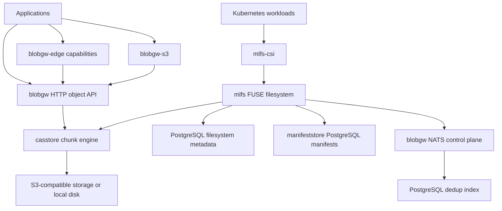

# Architecture

The stack separates physical bytes, object addressing, filesystem metadata,
and external access. Applications can adopt each interface independently.

The S3 and edge frontends use the gateway library or a configured gateway
backend; they need not be separate hops through an HTTP server.

**casstore** chunks content, stores packs, records manifests, deduplicates within
a domain, and verifies hashes on reads. Compression, ranged reads, batching,
and garbage collection share the same storage formats across consumers.

**blobgw** maps object refs onto stored content and exposes object and
control-plane operations. The control plane resolves tenant bindings, manages
dedup-index operations, and provides presigned pack access. In remote mlfs mode,
file bytes flow directly between a node and its S3-compatible backend.

**mlfs** stores filesystem metadata in PostgreSQL, file slices through casstore,
and manifests through the configured manifest store. Its local cache stages
writes durably before asynchronous upload. Ownership leases, fencing, and
change notifications coordinate multiple nodes within a domain.

**mlfs-csi** provisions and mounts domain-scoped volumes. Its pod launcher
separates mount-daemon lifetimes from the CSI node process. The CSI image also
contains the mlfs daemon and therefore has an explicit bundle release lifecycle.

**Isolation** depends on consistent domain mapping across backend bindings,
metadata databases, NATS accounts, credentials, and authorization. Keep the
trusted object/control-plane APIs inside the deployment boundary. Use the
capability edge or S3 authentication for the corresponding external interfaces.

The repository contains eight Go modules with independent release tags. A
workspace is a development convenience; published libraries depend on explicit
module versions. The Python HTTP client is a separate Apache-2.0 package.
